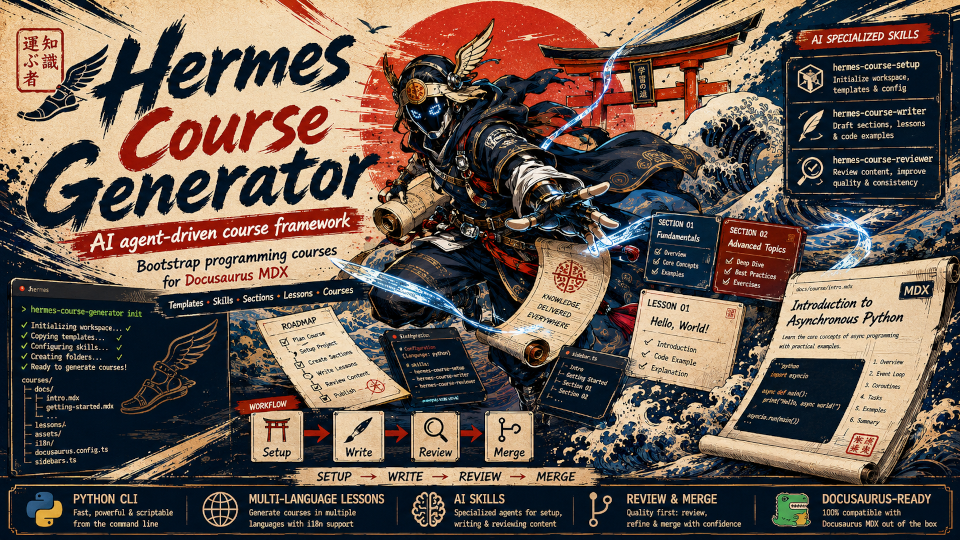

# Hermes Course Generator Toolset



The **Hermes Course Generator** is an automated toolset designed to set up, compile, and manage
programming courses (e.g., Rust, Python, Go) using AI Agents. It generates a standard directory
structure compatible with Docusaurus MDX and integrates directly with AI workflow templates.

---

## Cross-Platform AI Agent Support

This toolset is **platform-agnostic** and can be used with any modern AI Coding Agent:

- **Antigravity (Native)**: Provides native integration. The agent automatically detects and
  utilizes the `SKILL.md` configurations.
- **Claude Code, Cursor, & GitHub Copilot (Codex)**: Fully supported. Since the toolset relies on
  standard Markdown files and a Python CLI, you can simply load the `SKILL.md` or template files
  into the agent's context (e.g., by mentioning `@skills/hermes-course-writer/SKILL.md`) and
  instruct the AI to adopt the described role.

---

## Quick Start

### 1. Installation

Install the CLI tool, global templates, and agent skills directly from the repository:

```bash
curl -fsSL https://raw.githubusercontent.com/tranthethang/hermes-course-generator/main/install.sh | bash
```

_Note: Make sure `~/.local/bin` is in your environment `PATH` (e.g., in `~/.zshrc` or `~/.bashrc`)._

### 2. Uninstallation

To completely remove the CLI tool, global configurations, and registered skills from your system:

```bash
curl -fsSL https://raw.githubusercontent.com/tranthethang/hermes-course-generator/main/uninstall.sh | bash
```

### 3. Verify Setup

Ensure all components and global configuration directories are correctly configured:

```bash
./verify.sh
```

### 4. Initialize Workspace

To initialize a new course generator workspace at your current location or a specific path:

```bash
# In the current directory
hermes-course-generator init

# Or specify a custom path
hermes-course-generator init --path /path/to/new-course
```

---

## Commands & Scripts Reference

| Command / Script                                                     | Description                                                                        |
| :------------------------------------------------------------------- | :--------------------------------------------------------------------------------- |
| `hermes-course-generator init`                                       | Initializes a workspace, copying instruction templates and setting up directories. |
| `hermes-course-generator merge --level <level> --lesson <lesson_id>` | Merges individual section files (`.mdx`) into a single lesson.                     |
| `hermes-course-generator state update --key <key> --value <val>`     | Programmatically updates fields in `state.md` to track progress.                   |
| `./format.sh`                                                        | Automatically formats all Markdown and MDX files in the workspace using Prettier.  |
| `./uninstall.sh`                                                     | Removes the CLI tool, configurations, and global skills from your system.          |

---

## Repository Structure

- [bin/](bin) — Python source code for the `hermes-course-generator` CLI.
- [skills/](skills) — Definitions of global specialized skills for AI Agents:
  - `hermes-course-setup` — Workspace setup and initial configuration.
  - `hermes-course-writer` — Detailed research and step-by-step section drafting.
  - `hermes-course-reviewer` — Quality gate review, compiler validation, and lesson merging.
- [templates/](templates) — Core instructional templates and style guides.
  - [hermes_workflow.md](templates/hermes_workflow.md) — The generation workflow.
  - [file_naming_convention.md](templates/file_naming_convention.md) — Slugification and output
    structure.
  - [style_guide.md](templates/style_guide.md) — Writing and styling standards.
  - [task_examples.md](templates/task_examples.md) — Examples for each AI task.

---

## Triggering the AI Agent Workflow

The multi-agent workflow operates in three distinct phases:

### Phase 1: Setup

Trigger the setup agent by prompting:

> "I want to set up a new course for [Rust/Python/Go]. Please use the `hermes-course-setup` skill
> and interview me to collect the required settings."

### Phase 2: Writing Sections

Trigger the writer agent for a specific section by prompting:

> "Please write the section [Lesson ID] [Section ID] [Section Title] using the
> `hermes-course-writer` skill."

### Phase 3: Reviewing & Merging Lessons

Trigger the reviewer agent to check and merge approved sections into a lesson by prompting:

> "Please review the sections and merge [Lesson ID] using the `hermes-course-reviewer` skill."
